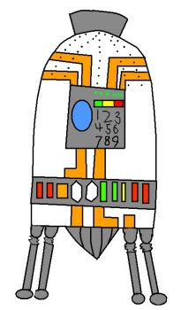

<p align="center">
  
</p>

<h1 align="center">
  <a href="https://github.com/karimsa/fldsmdfr">fldsmdfr</a>
</h1>

<p align="center">
  <a href="https://travis-ci.org/karimsa/fldsmdfr">
    
  </a>

  <a href="https://codecov.io/gh/karimsa/fldsmdfr">
    
  </a>
</p>

Strongly typed JSON.

## About

JSON is great for humans, sucks for storage. This tool is tasked at forcing APIs to strongly
type the parameters for their endpoints. This allows fldsmdfr to optimize all data sent over
the network in terms of space.

## Usage

Install via `npm i --save fldsmdfr`.

Two methods: `BJSON.stringify()` & `BJSON.parse()` - designed to be as similar to the native
`JSON.*` methods as possible. The only difference is that it will required an extra parameter
which should be a type mapping.

**Examples**

```javascript
BJSON.stringify({ msg: 'Hello, world' }, { msg: 'string' }) // returns a Buffer
```

```javascript
BJSON.parse(`<Buffer ...>`, { msg: 'string' }) // returns: { msg: 'Hello, world' }
```

## License

Licensed under [MIT license](LICENSE.md).

Copyright &copy; 2017-present Karim Alibhai.